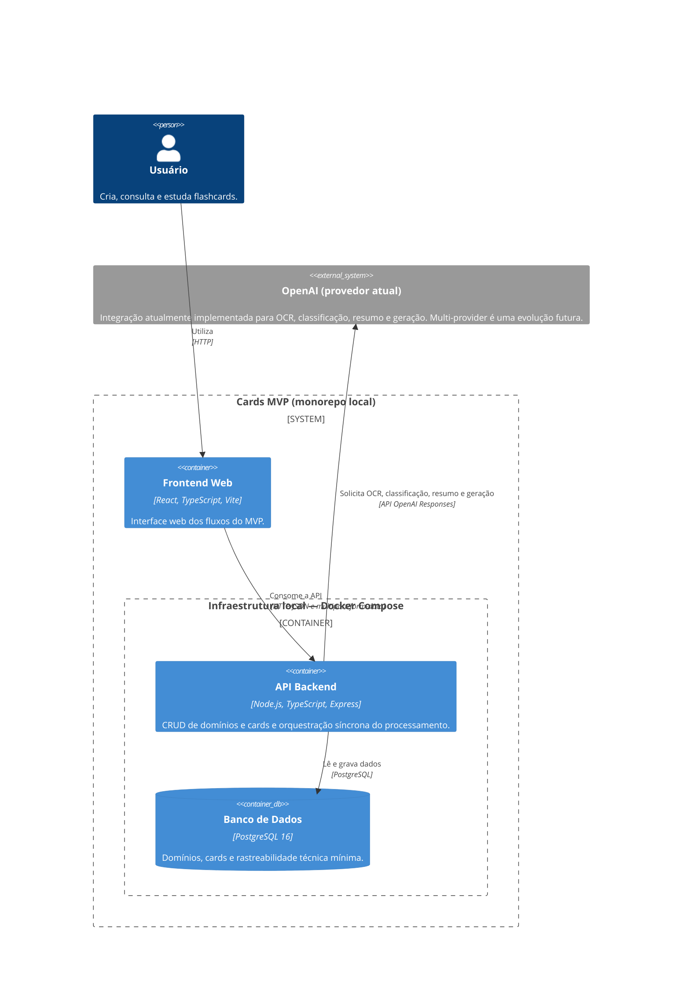
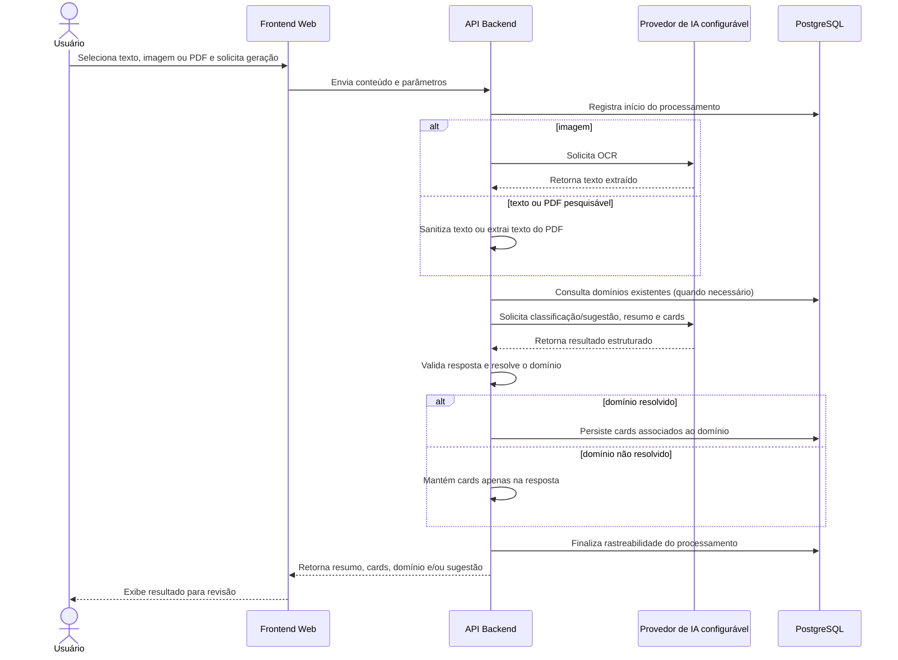

# Cards MVP

Monorepo do MVP de criação e organização de flashcards. Ele reúne uma API para gestão e geração de cards a partir de texto, imagem ou PDF e uma interface web para consumo dessa API.

## Discovery de documentação e diagrams as code

Este repositório concentra a documentação versionável do sistema Cards MVP, um sistema local para auxiliar estudos com flashcards. O objetivo é permitir a criação e manutenção de domínios e cards e a geração em massa de cards a partir de texto, imagens ou PDFs pesquisáveis com apoio de IA.

### Escopo, nível e limites

- **Escopo:** frontend web, API backend, PostgreSQL, infraestrutura local e integração de IA (OpenAI no estado atual).
- **Nível estrutural:** C4 Containers; o diagrama mostra responsabilidades de containers e dependências, sem endpoints, classes ou módulos internos.
- **Jornada comportamental:** processamento de conteúdo até o retorno de resumo e cards, com persistência condicional.
- **Limite do sistema:** frontend, API e banco pertencem ao Cards MVP; o provedor de IA é externo ao limite.
- **Responsabilidades:** o frontend conduz a interação; a API valida e orquestra; o PostgreSQL persiste domínios, cards e rastreabilidade mínima.
- **Ambiente:** exclusivamente local. O Docker Compose atual executa API e PostgreSQL; o frontend é iniciado separadamente.

Não fazem parte do escopo atual autenticação, produção, fila, processamento assíncrono, object storage, algoritmo de revisão espaçada e retenção definida de arquivos. PDFs sem camada de texto utilizável são rejeitados no fluxo documentado.

### Diagrama estrutural — C4 Containers



### Diagrama comportamental — geração de cards a partir de conteúdo



## Arquitetura

```text
.
├── backend/   # API REST, regras de negócio, integrações e migrations
└── frontend/  # aplicação web
```

| Aplicação  | Stack                                            | Responsabilidade                                                    |
| ---------- | ------------------------------------------------ | ------------------------------------------------------------------- |
| `backend`  | Node.js, TypeScript, Express, PostgreSQL, OpenAI | CRUD de domínios e cards; processamento e geração assistida por IA. |
| `frontend` | React, TypeScript, Vite, React Query, Zustand    | Interface para os fluxos do MVP.                                    |

## Pré-requisitos

- Node.js 22 ou superior
- npm
- PostgreSQL 16 ou Docker Compose
- Uma chave da OpenAI para os fluxos de processamento do backend

## Início rápido

1. Crie os arquivos locais de configuração a partir dos exemplos:

   ```bash
   cp backend/.env.example backend/.env
   cp frontend/.env.example frontend/.env
   ```

   No PowerShell, use `Copy-Item backend/.env.example backend/.env` (e o equivalente para o frontend).

2. Ajuste `backend/.env`, principalmente `DATABASE_URL` e `OPENAI_API_KEY`.

3. Instale as dependências:

   ```bash
   npm ci --prefix backend
   npm ci --prefix frontend
   ```

4. Suba o PostgreSQL e aplique as migrations:

   ```bash
   cd backend
   docker compose up -d postgres
   npm run db:migrate
   ```

5. Em terminais separados, inicie as aplicações:

   ```bash
   npm --prefix backend run dev
   npm --prefix frontend run dev
   ```

| Serviço  | Endereço padrão                |
| -------- | ------------------------------ |
| Frontend | `http://localhost:5173`        |
| API      | `http://localhost:3000`        |
| API base | `http://localhost:3000/api/v1` |

## Variáveis de ambiente

Os contratos de configuração estão nos arquivos `.env.example` de cada aplicação.

| Arquivo         | Variáveis relevantes                                                                       |
| --------------- | ------------------------------------------------------------------------------------------ |
| `backend/.env`  | `PORT`, `DATABASE_URL`, `OPENAI_API_KEY`, modelos OpenAI, CORS e limites de processamento. |
| `frontend/.env` | `VITE_API_URL`, URL base da API usada pelo cliente web.                                    |

Nunca versione arquivos `.env`, chaves privadas ou certificados. O `.gitignore` raiz cobre esses arquivos e mantém apenas os modelos `.env.example` sob controle de versão.

## API e documentação

Os principais recursos da API são domínios de estudo, cards e processamentos. A referência completa de endpoints, contratos HTTP e decisões de arquitetura está em [backend/docs](backend/docs).

Para executar API e banco por Docker, a configuração está em `backend/docker-compose.yml`:

```bash
cd backend
docker compose up --build
```

## Qualidade

Antes de abrir um pull request, execute:

```bash
npm --prefix backend run build
npm --prefix backend test
npm --prefix frontend run build
npm --prefix frontend run lint
```
